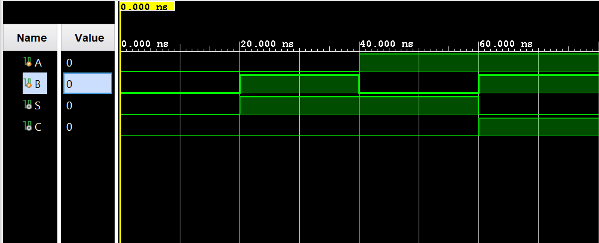

# Half Adder

A Verilog implementation of a half adder, developed in Vivado IDE. This document provides theory, derivations, and simulation results for the circuit.

---

## Table of Contents

- [What Is a Half Adder?](#what-is-a-half-adder)
- [Learning Resources](#learning-resources)
- [Truth Table](#truth-table)
- [K-Maps](#k-maps)
- [Simplified Boolean Equations](#simplified-boolean-equations)
- [Circuit Diagram](#circuit-diagram)
- [Waveform Diagram](#waveform-diagram)
- [Testbench Output](#testbench-output)
- [Running the Project in Vivado](#running-the-project-in-vivado)
- [Project Files](#project-files)

---

## What Is a Half Adder?

A **half adder** is a combinational circuit that adds two single binary bits and produces two outputs: a **sum** (**S**) and a **carry** (**C**). It is the simplest form of a binary adder and is a fundamental building block for larger adders (e.g. full adders, ripple-carry adders) used in CPUs, ALUs, and digital arithmetic units.

- **Inputs:** Two bits **A** and **B** (the two bits to be added).
- **Outputs:**
  - **S** (sum): the least significant bit of A + B (0+0=0, 0+1=1, 1+0=1, 1+1=0 with carry).
  - **C** (carry): the carry out when A + B ≥ 2 (only 1 when both A and B are 1).

So the half adder performs one-column binary addition: it has no carry-in, only a carry-out. The sum bit **S** is the XOR of **A** and **B**, and the carry bit **C** is the AND of **A** and **B**. Half adders are used wherever two bits are added in isolation, or as the first stage in multi-bit adders.

---

## Learning Resources

Useful online resources for half adders and digital design:

| Resource | Description |
|----------|-------------|
| [Half Adder (YouTube)](https://www.youtube.com/results?search_query=half+adder) | Search for “half adder” for step-by-step explanations and truth tables. |
| [Half Adder Verilog (YouTube)](https://www.youtube.com/results?search_query=half+adder+verilog) | Search for “half adder Verilog” for RTL and testbench examples. |
| [K-Map Simplification (YouTube)](https://www.youtube.com/results?search_query=karnaugh+map+simplification) | Search for “Karnaugh map simplification” to see how sum and carry equations are derived. |
| [Logic Gates – AND, XOR (YouTube)](https://www.youtube.com/results?search_query=logic+gates+XOR+AND) | Search for “logic gates XOR AND” for gate behavior and truth tables. |

---

## Truth Table

The half adder has two inputs (**A**, **B**) and two outputs (**S**, **C**). The table below lists all four input combinations and the corresponding sum and carry.

| **A** | **B** | **‖** | **S** | **C** |
|:-----:|:-----:|:-----:|:-----:|:-----:|
| **———** | **———** | **———** | **———** | **———** |
| 0 | 0 | **\|** | 0 | 0 |
| 0 | 1 | **\|** | 1 | 0 |
| 1 | 0 | **\|** | 1 | 0 |
| 1 | 1 | **\|** | 0 | 1 |

---

## K-Maps

Karnaugh maps for the two outputs **S** and **C** in terms of **A** and **B**. Rows are **A**, columns are **B**.

### Sum (S)

| **A \ B** | **0** | **1** |
|:---------:|:-----:|:-----:|
| **0** | 0 | 1 |
| **1** | 1 | 0 |

**Observation:** **S** is 1 when A and B differ. No single grouping of 1s simplifies to a product term; the minimal expression is the XOR of A and B.

$$S = A \oplus B$$

---

### Carry (C)

| **A \ B** | **0** | **1** |
|:---------:|:-----:|:-----:|
| **0** | 0 | 0 |
| **1** | 0 | 1 |

**Observation:** **C** is 1 only when both A and B are 1. This is a single minterm, or the AND of A and B.

$$C = A \cdot B = AB$$

---

## Simplified Boolean Equations

Summary of the simplified expressions used in the Verilog RTL (⊕ = XOR, · = AND):

**Sum:**

$$S = A \oplus B$$

**Carry:**

$$C = A \cdot B$$

In Verilog, these are implemented as `assign S = A ^ B;` and `assign C = A & B;` respectively.

---

## Circuit Diagram


*Circuit diagram: half adder with inputs A, B and outputs S (sum) and C (carry), using one XOR gate and one AND gate.*

---

## Waveform Diagram

Simulation waveform for the half adder. Inputs **A** and **B** cycle through all four combinations 00, 01, 10, 11; outputs **S** and **C** follow the truth table.



*Waveform: inputs A, B and outputs S (sum), C (carry).*

---

## Testbench Output

Terminal output from the testbench for all four input combinations (A, B):

```
 A=0, B=0, S=0, C=0 

 A=0, B=1, S=1, C=0 

 A=1, B=0, S=1, C=0 

 A=1, B=1, S=0, C=1 
```

These results match the truth table and confirm that the half adder produces the correct sum and carry for each (A, B) pair.

---

## Running the Project in Vivado

Follow these steps to open the project in **Vivado** and run simulation.

### Prerequisites

- **Xilinx Vivado** installed (Vivado HL Design Edition or Lab Edition; any recent version that supports your OS).

### 1. Launch Vivado

Start Vivado from the Start Menu (Windows) or your application launcher. Choose **Vivado HLx** (or **Vivado**).

### 2. Create a New Project

1. Click **Create Project** (or **File → Project → New**).
2. Click **Next** on the welcome page.
3. Choose **RTL Project** and leave **Do not specify sources at this time** unchecked if you want to add sources in the next step, or check it and add sources later. Click **Next**.
4. Add design and simulation sources:
   - Click **Add Sources** → **Add or create design sources** → **Add Files** and add `halfAdder.v`.
   - Click **Add Sources** → **Add or create simulation sources** → **Add Files** and add `halfAdder_tb.v`.
   - Ensure the testbench is set as the **top** for simulation (right‑click `halfAdder_tb.v` in the Sources window → **Set as Top** for simulation).
5. Click **Next**, select your **target device** (e.g. a default FPGA/part or “Don’t specify” for simulation-only), then **Next** → **Finish**.

### 3. Run Behavioral Simulation

1. In the **Flow Navigator** (left panel), under **Simulation**, click **Run Behavioral Simulation**.
2. Vivado will compile the design and testbench and open the **Simulation** view with the waveform.
3. Use the waveform to verify that inputs A, B and outputs S, C match the [truth table](#truth-table) and [testbench output](#testbench-output) above.

### 4. (Optional) Re-run or Reload

- To re-run: **Flow Navigator → Simulation → Run Behavioral Simulation** (or use the re-run button in the simulation toolbar).
- To change the testbench or RTL, edit the `.v` files, save, then run simulation again.

### 5. (Optional) Synthesis and Implementation

If you want to target real hardware:

1. Set `halfAdder` as the top module: in **Sources**, right‑click `halfAdder.v` → **Set as Top**.
2. Run **Synthesis** from the Flow Navigator, then **Implementation**, then **Generate Bitstream** (after assigning pins in a constraints file if required).

---

## Project Files

- `halfAdder.v` — RTL for the half adder (inputs A, B; outputs S, C)
- `halfAdder_tb.v` — Testbench

*Author: Kadhir Ponnambalam*
